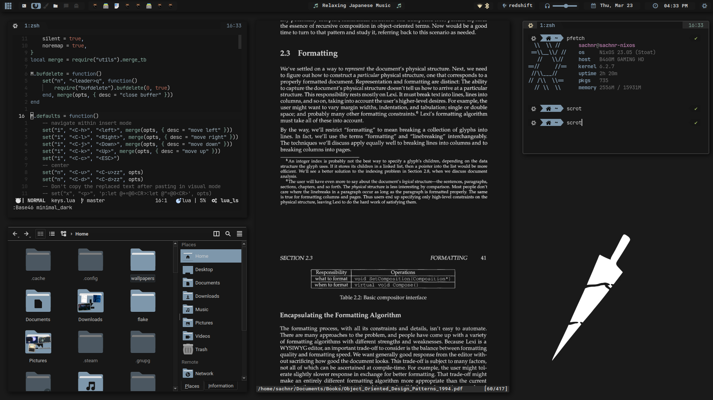
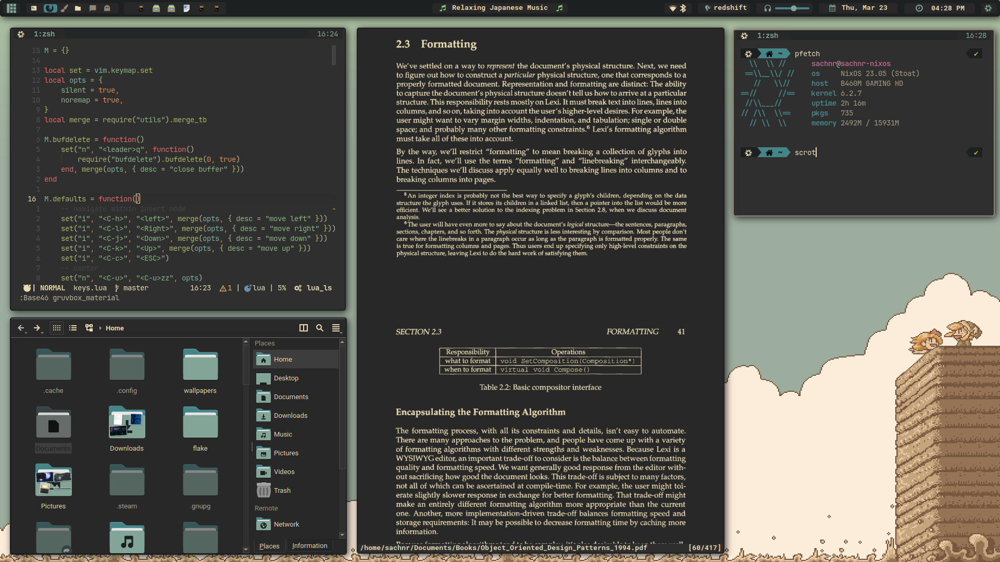
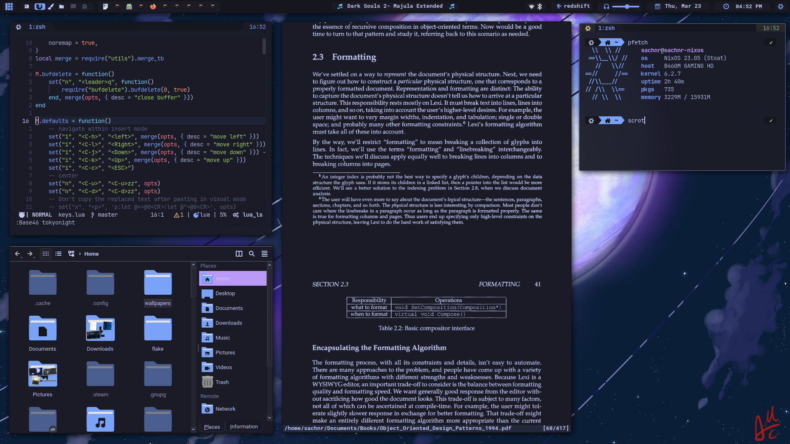

| screenshots         |
| ------------------- |
|  |
|  |
|  |

### **Dependencies**

- mpc-cli for mpd
- ffmpeg for getting cover art from music files

### **Note**

#### for pulseaudio

when using _[pulseaudio module](./bar/modules/pulseaudio)_ for controlling volume via dbus, you will also need

- [lua-pulseaudio_dbus](https://github.com/stefano-m/lua-pulseaudio_dbus)
- [lua-dbus_proxy](https://github.com/stefano-m/lua-dbus_proxy)

  nix users can get it from [nix-stefano-m-nix-overlays](https://github.com/stefano-m/nix-stefano-m-nix-overlays), for other distros install using luarocks

  then enable `module-dbus-protocol`,
  either by manually running `pactl load-module module-dbus-protocol` or automatically on every boot by adding

  ```
  load-module module-dbus-protocol
  ```

  to $XDG_CONFIG_DIRS/pulse/default.pa file

#### for pipewire

everything is controlled using bash commands, `wpctl` and `pactl` should be present on your system

**[more info](./assets/readme.md)**
